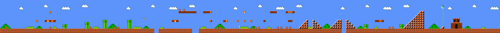

#  Hey, I'm Diya 

🇬🇧 I am Computer Science student based in Alsace, France and am currently looking for an apprenticeship for the 26/27 school year !

🇫🇷 Je suis étudiant, je prépare un BUT Informatique : Parcours développement d'application en Alsace et je suis actuellement à la recherche d'une alternance pour la rentrée 2026/27 !

##  About me

I am french-algerian 🇫🇷🇩🇿  
Estou a aprender português 🇵🇹  
Currently struggling with OOP...  
I'd kill for a shawarma or kebab right now 🥙  
I love to watch TV series, learn languages, cook and play video games   
 

##  Projects 

<table>
  <tr>
    <td width="50%" valign="top">
      <h3 align="center"><a href = 'https://github.com/Dididouu/Casern-App'>Casern'App 🚒</a></h3>
      

        
        
        
        
         
        

          <strong>🇬🇧 Gestion application for firefighters</strong>
           
          <strong>🇫🇷 Application de gestion pour caserne de pompiers.</strong>
        

      

    </td>
    <td width="50%" valign="top">
      <h3 align="center"><a href = 'https://github.com/Dididouu/DoonjonEtDragon'>Doonjon&Dragons 🐉</a></h3>
      

        
         
        

          <strong>🇬🇧 D&D Game in your terminal, made in Java!</strong>
           
          <strong>🇫🇷 Donjons et Dragons dans ton terminal, fait en Java !</strong>
        

      

    </td>
  </tr>
  <tr>
    <td width="50%" valign="top">
      <h3 align="center"><a href = 'https://github.com/Dididouu/Simulation-reseau-local'>Simulation réseau 🤖</a></h3>
      

        
         
        

          <strong>🇬🇧 Local network simulation with STP Protocol implementation in C.</strong>
           
          <strong>🇫🇷 Simulation d'un réseau local avec protcole STP implémenté, en C.</strong>
        

      

    </td>
    <td width="50%" valign="top">
      <h3 align="center"><a href = 'https://github.com/Dididouu/ArchiPoleSud'>Archi Pôle Sud 🧊</a></h3>
      

        
         
        

          <strong>🇬🇧 Our serious game about building the best place to live for a crew of scientists in the south pole!</strong>
           
          <strong>🇫🇷 Notre jeu sérieux ou il faut construire le meilleur milieu de vie pour une équipe de scientifiques au Pôle Sud !</strong>
        

      

    </td>
  </tr>
</table>

##  Tech stack

#### Languages

       

#### Web 

   

#### Frameworks

    

#### Databases

  
 
 

##  Goals / Objectifs 

- **Court terme / Short term**
  - 🇬🇧 Improve myself in low-level development and learn to produce more efficient code. 
  - 🇫🇷 M'améliorer en développement bas niveau et apprendre à produire du code plus efficace.

- **Long terme** 
  - 🇬🇧 Throwing myself deeper in the Networking sea, a subject that recently really started to interest me.
  - 🇫🇷 Aller plus loin dans le monde du réseau qui a fortement suscité mon intérêt dernièrement.

##  Contact

Don't hesitate to get in touch with me, I'll answer as soon as possible !

 
